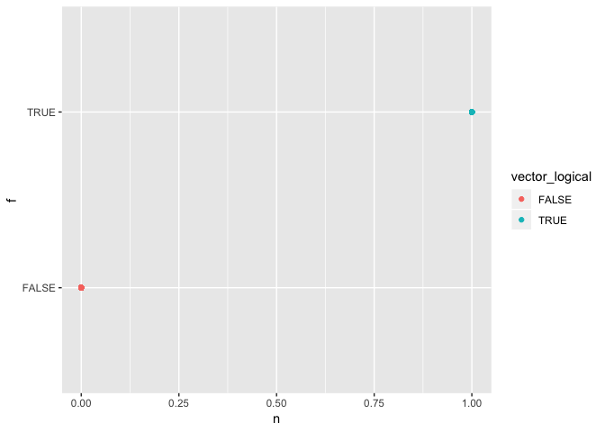
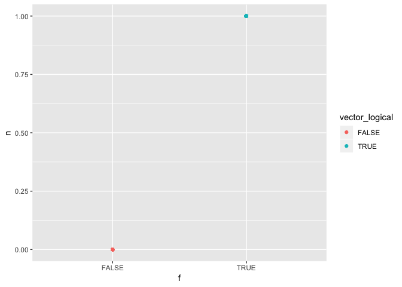

p8105\_hw1\_hn2339
================

``` r
# random sample of size 10 from unifom distrubution [0,5]
sample_random = runif(10, min = 0, max = 5)
# show the random result 
sample_random
```

    ##  [1] 2.3870908 0.6898794 1.2097447 0.7454354 2.7162721 0.6271307 0.8607303
    ##  [8] 2.7553407 4.7675643 4.2299667

``` r
# take the mean of the variable 
mean(sample_random)
```

    ## [1] 2.098916

``` r
# whether the elements from the sample > 2 
logical_vector = sample_random > 2
typeof(logical_vector)
```

    ## [1] "logical"

``` r
# create a character vector length of 10
character = c("a", "b", "c", "d", "e", "f", "g", "h", "i", "j")
length(character)
```

    ## [1] 10

``` r
# can not determine the mean because character vector is not numcerial or logical
mean(character)
```

    ## Warning in mean.default(character): argument is not numeric or logical:
    ## returning NA

    ## [1] NA

``` r
# create a factor vector lenght of 10
me.vector = c("a", "b", "c", "d", "e", "f", "g", "h", "i", "j")
factor.me.vector = factor(me.vector)
factor.me.vector
```

    ##  [1] a b c d e f g h i j
    ## Levels: a b c d e f g h i j

``` r
length(factor.me.vector)
```

    ## [1] 10

``` r
# cannot take the mean of factor vector because it is not numerical or logical 
mean(me.vector)
```

    ## Warning in mean.default(me.vector): argument is not numeric or logical:
    ## returning NA

    ## [1] NA

``` r
# conver character to factor to numeric is successful 
character_factor_numeric = as.factor(character)
as.numeric(character_factor_numeric)
```

    ##  [1]  1  2  3  4  5  6  7  8  9 10

``` r
# convert factor to character is successful but character to numeric is not successful 
factor_character = as.character(me.vector)
as.numeric(factor_character)
```

    ## Warning: 强制改变过程中产生了NA

    ##  [1] NA NA NA NA NA NA NA NA NA NA

``` r
#from the environment, the size of plot_df is 1000, the mean of x is - 0.01164814 the median of x is -0.03532423, 49% of the logical vector is true 
set.seed(1)
library(tidyverse)
```

    ## ─ Attaching packages ─────────────── tidyverse 1.2.1 ─

    ## ✔ ggplot2 3.0.0     ✔ purrr   0.2.5
    ## ✔ tibble  1.4.2     ✔ dplyr   0.7.6
    ## ✔ tidyr   0.8.1     ✔ stringr 1.3.1
    ## ✔ readr   1.1.1     ✔ forcats 0.3.0

    ## ─ Conflicts ──────────────── tidyverse_conflicts() ─
    ## ✖ dplyr::filter() masks stats::filter()
    ## ✖ dplyr::lag()    masks stats::lag()

``` r
plot_df = tibble(
  x = rnorm(1000, mean = 0, sd = 1),
  y = rnorm(1000, mean = 0, sd = 1),
  vector_logical = c(x + y > 0),
  typeof(vector_logical),
  median(x),
  mean(x),
  n = as.numeric(vector_logical),
  f = as.factor(vector_logical)
)
ggplot(plot_df, aes(x = x, y = y, col = "red" )) + geom_point()
```


``` r
ggsave("plot_df.pdf")
```

    ## Saving 7 x 5 in image

``` r
ggplot(plot_df, aes(x = n, y = f, col = "black" )) + geom_point()
```



``` r
ggplot(plot_df, aes(x = f, y = n, col = "blue" )) + geom_point()
```


